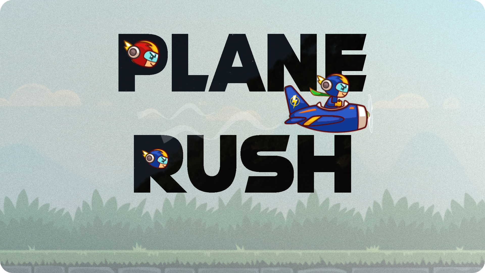
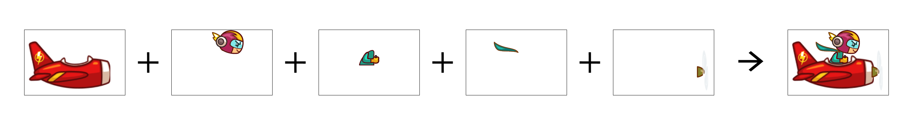

# Plane Rush API



> A Custom API which returns Random NFT images along with some metadata through an IPFS Hash
<br />

## About the API

✔️ The API is built using `NodeJS` and `ExpressJS`.

✔️ The API endpoint takes in 2 query parameters namely `characterId`(ID of the character in the smart contract) and `score`(new high score/checkpoint that the user has achieved in the game).

✔️ The `Airspeed` of the new NFT generated will depend on the new high score achieved and is scaled accordingly inside the game. The air speed is also randomized to a certain extent.

✔️ The `name` of the new NFT is being generated using the characterId.

✔️ The most interesting part of the API is the Random image generation part. The NFT is divided into 5 components such as body, collar, helmet, plane and propellor. Everytime the API is called, the `mixComponents.js` file returns a PNG which is a randomized combination of image collection in each component. The components are stored in the folder `components`. See the image below to understand it better.



✔️ The NFT metadata is a `JSON` file which comprises of a name, description, image URL and some traits(airSpeed of the Plane in this case). This metadata is stored in `Filecoin` and `IPFS` using `nft.storage`.


It is a free decentralized off-chain storage of NFT data. After uploading the JSON to `nft.storage`, an IPFS hash is returned which is returned by the API.

✔️ `Chainlink Oracles` are used to fetch the data using API calls. The smart contracts are deployed to `Polygon Mumbai` testnet and the suitable Oracle which is used to GET `bytes32` data on-chain is [Linkriver](https://linkriver.io/). Since `bytes32` variable can only hold 32 characters of data, the first endpoint returns the first 31 characters of the IPFS hash. We had to optimize the API to create a second endpoint which contains the next 28 characters of the IPFS hash.

✔️ By this way, we can solve the problem of getting the IPFS hash from off-chain into on-chain using Chainlink by making 2 API calls which can further be used to set the Token URI for the NFT in the smart contract.

✔️ Finally, the API is hosted using Heroku which is a cloud platform. The base URL for the hosted API is https://randomize-character.herokuapp.com/

## Built With

- [nft.storge](https://nft.storage/) - Free Storage for NFTs
- [NodeJS](https://nodejs.org/en/) - Node.js is an open-source, cross-platform, back-end JavaScript runtime environment
- [ExpressJS](https://expressjs.com/) - Express.js is a back end web application framework for Node.js
- [Heroku](https://www.heroku.com/) - Heroku is a cloud platform which is used to host the API

## Getting Started

These instructions will get you a copy of the project up and running on your local machine for testing purposes

### Prerequisites

Please make sure you've already installed NPM package.

### Installing

A step by step guide to locally run the API

- First, get a free API key from [nft.storage](https://nft.storage/)
- Clone this repository:

```
git clone https://github.com/DineshBS44/RandomizeNFT
```

- Install all the required packages using the following command

```
npm install
```

- Create a `.env` file and store the following content in it and include API key of `nft.storage`:

```
NFT_STORAGE_API_KEY="<nft.storage API Key>"
```

- To test the API endpoint locally, use the following command:

```
node server.js
```

- Now open http://localhost:4000/?score=400&characterId=2 in your browser to view the first 32 characters of the IPFS Hash of a Randomly generated NFT's metadata. The `characterId` and `score` are passed as query parameters to the API. To view the next 28 characters of the IPFS Hash, call http://localhost:4000/second which is the 2nd endpoint.

- To use the same API which is hosted using Heroku, open the link https://randomize-character.herokuapp.com/ which is the base URL for the API.

## Libraries/services used

- **nft.storage** - To store NFT's metadata to `Filecoin` and `IPFS`
- **images** - Used to blend different image components to return a new PNG file
- **express** - backend web framework for Node JS
- **dotenv** - To manage data in `.env` files
- **node-fetch** - A light weight module that brings Fetch API to Node JS

## Developers

- **Dinesh B S** [(@DineshBS44)](https://github.com/DineshBS44)

## License

Licensed under MIT License : https://opensource.org/licenses/MIT

<br>
<br>
